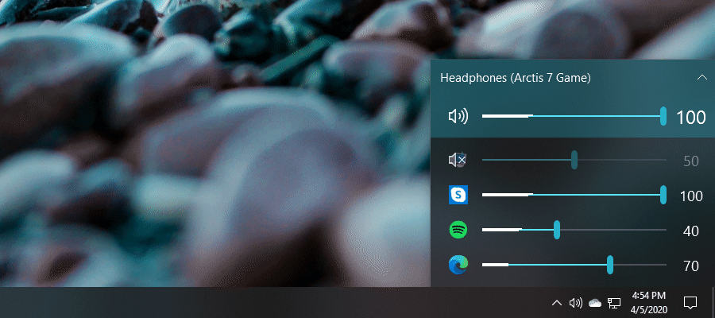

# EarTrumpet

    

## Awards

2022 Winner of the [Microsoft Store Community Choice Awards](https://blogs.windows.com/windowsdeveloper/2022/05/27/announcing-the-microsoft-store-app-awards-winners/#:~:text=open%20platform%20category) (Open Platform)
> Windows is an open platform for innovation. We know that not every customer uses Windows in the same way — some want to modify different parts of the UI or make some features more accessible for them. These are the apps you said turn Windows into your Windows.

## Media coverage

> [...] there are alternative solutions like EarTrumpet which are great [...]
>
> &mdash; [Linus Tech Tips (February 12, 2025)](https://youtu.be/6wgHq9NZru0?t=461)

> [...] there are third-party solutions out there that do a much better job than what Windows offers by default. One such app is called EarTrumpet [...]
>
> &mdash; [TechQuickie (Jan 11, 2022)](https://www.youtube.com/watch?v=xQvp5HzY9xc)

> Microsoft's built-in Windows 11 audio management still isn't great. EarTrumpet overhauls it completely, with a system tray utility that gives you volume levels for every app and the ability to set custom inputs and outputs for those apps.
>
> &mdash; [The Verge (Dec 30, 2021)](https://www.theverge.com/22837232/windows-11-pc-best-apps-microsoft-2021)

> If you want fine-tuned control of your app and system volume, EarTrumpet is a must.
>
> &mdash; [Windows Central (Jun 19, 2018)](https://www.windowscentral.com/eartrumpet-review-best-audio-control-app-windows)

## Sponsors

<!-- sponsors --><!-- sponsors -->

## Features

* Visualize audio with multi-channel aware peaking
* Standalone volume mixer
* Move apps between playback devices
* Default playback device management
* Automatic updates via the Microsoft Store
* Support for light/dark mode and all accent colors
* Configurable hotkeys
* Modern context menus
* Growing multilingual support

## Internationalization

Thanks to our translators, we currently support 20+ languages. Are we missing your language? [Contribute a translation via Crowdin](https://crowdin.com/project/eartrumpet)!

### Translators

<!-- begin-translators -->
                                                                                                                                                                  
<!-- end-translators -->

## Install

Install EarTrumpet from the [Microsoft Store](https://www.microsoft.com/store/apps/9nblggh516xp)

Or via command line using either
- [Windows Package Manager Client (winget)](https://github.com/microsoft/winget-cli) (`winget install File-New-Project.EarTrumpet`)
- Chocolatey (`choco install eartrumpet`)

## Experimental dev builds

Want to see what we were working on? Or help us test new features? [Install EarTrumpet from the dev channel.](https://install.eartrumpet.app/dev/EarTrumpet.Package.appinstaller) New builds are released automatically every time we commit to the `dev` branch, keeping you up to date on our progress.

## Documentation
* [Technical Information](./EarTrumpet/README.md)
* [Compiling EarTrumpet](./COMPILING.md)
* [Contributing to EarTrumpet](./CONTRIBUTING.md)
* [Information Collected And Transmitted By EarTrumpet](./PRIVACY.md)
* [Project License](./LICENSE)
* [Change Log](./CHANGELOG.md)

## Supported operating systems
- Windows 10 1803 (April 2018 Update)
- Windows 10 1809 (October 2018 Update)
- Windows 10 1903 (May 2019 Update)
- Windows 10 1909 (November 2019 Update)
- Windows 10 2004 (May 2020 Update)
- Windows 10 20H2 (October 2020 Update)
- Windows 10 21H1 (May 2021 Update)
- Windows 10 21H2 (November 2021 Update)
- Windows 10 22H2 (October 2022 Update)
- Windows 11

## Credits
- David Golden ([@GoldenTao](https://www.twitter.com/GoldenTao))
- Rafael Rivera ([@WithinRafael](https://www.twitter.com/WithinRafael))
- Dave Amenta ([@davux](https://www.twitter.com/davux))
- [Contributors](https://github.com/File-New-Project/EarTrumpet/graphs/contributors)

## Special thanks

"[Horn](https://thenounproject.com/icon/horn-125731/)" icon by Artjom Korman from [the Noun Project](https://thenounproject.com/)

