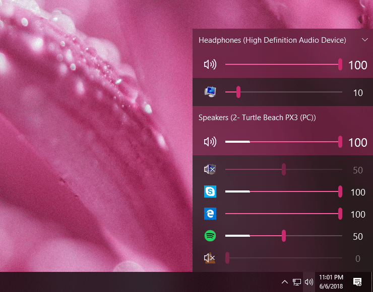
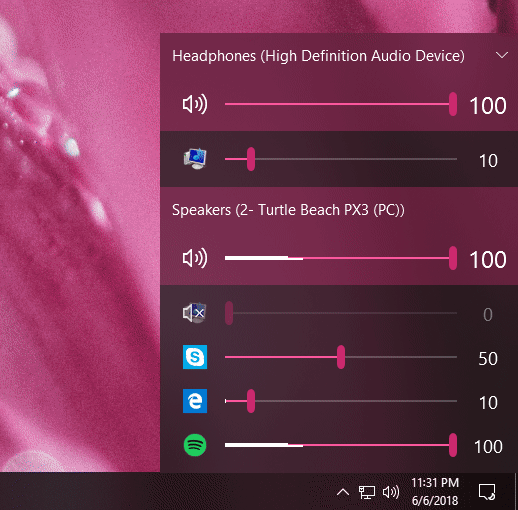

# EarTrumpet

## Features

### Visualize Audio with Multi-Channel Aware Peaking

### Standalone Volume Mixer

### Move Apps Between Playback Devices

### ... And More
* Default playback device management
* Automatic updates via the Microsoft Store
* Support for light/dark mode and all accent colors
* Configurable hotkeys
* Modern context menus
* Growing multi-lingual support

## Install

Download EarTrumpet from the [Microsoft Store](https://www.microsoft.com/en-us/p/eartrumpet/9nblggh516xp)

## Supported operating systems ##
- Windows 10 1803 (April 2018 Update)
- Windows 10 1809 (October 2018 Update)
- Windows 10 1903 (May 2019 Update)

## Known issues ##
- SoundCloud audio cannot be adjusted ([#178](https://github.com/File-New-Project/EarTrumpet/issues/178))
- Error: Windows cannot find "[...] EarTrumpet.exe". Make sure you typed the name correctly, and then try again ([#274](https://github.com/File-New-Project/EarTrumpet/issues/274))
- EarTrumpet holds some programs in use (Twitch, Spotify, Telegram, etc.) ([#273](https://github.com/File-New-Project/EarTrumpet/issues/273))
- EarTrumpet windows move slowly on Windows 10 19H1+ ([#349](https://github.com/File-New-Project/EarTrumpet/issues/349))
- EarTrumpet crashes when Segoe fonts have Mark of Web ([#367](https://github.com/File-New-Project/EarTrumpet/issues/367))

## Credits ##
- David Golden ([@GoldenTao](https://www.twitter.com/GoldenTao))
- Rafael Rivera ([@WithinRafael](https://www.twitter.com/WithinRafael))
- Dave Amenta ([@davux](https://www.twitter.com/davux))
- [Contributors](https://github.com/File-New-Project/EarTrumpet/graphs/contributors)
